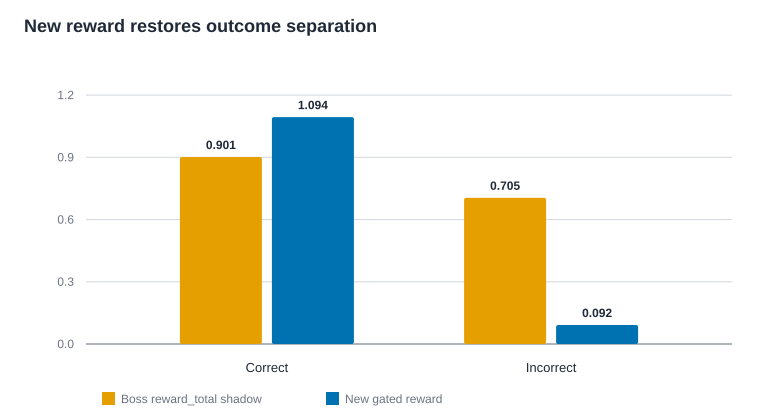
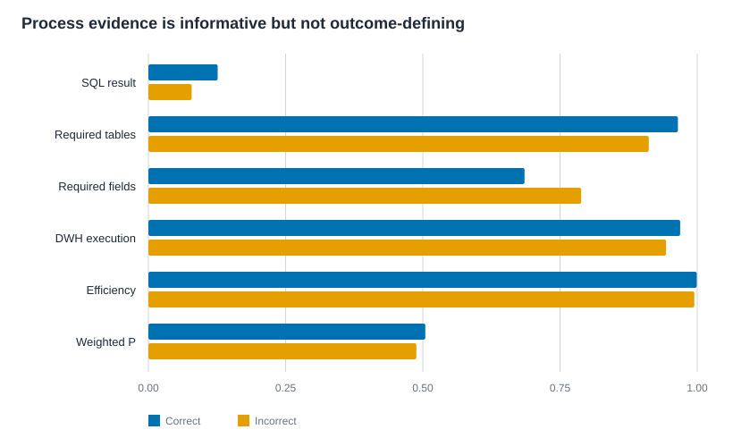

# Qwen3.8 多轮轨迹过程奖励 Shadow Replay

## 技术结论

新奖励公式本身通过了结果支配性验证，但现有 800 条历史轨迹暴露出一个启动阻断项：43 个批准 mixed 组中，只有 35 组的 8 条轨迹全部通过协议与只读工具硬门；另 8 组至少含 1 条不可训练轨迹，必须整组跳过或重采。正式训练继续暂停，`formal_training_allowed=false`。

公式层面，43/43 组均满足“任意正确轨迹奖励严格大于任意错误轨迹”，最小间隔为 `0.82`。实际应用硬门后，3 组中的正确轨迹因协议/只读门失败被硬置零，因此不能再宣称 43 个历史组全部可直接训练；这 3 组属于上述 8 个整组排除项。35 个完全合格组全部保持严格分离。

22 道修复后的表格 mixed 题全部复现：22/22 的逐题正确数与批准审计一致，22/22 仍为 mixed，旧表格假阴性没有复发。

## 关键结果与可视证据

旧老板 `reward_total` 的 shadow 重建中，错误轨迹平均仍有 `0.705`，中位数 `0.75`；新奖励下错误轨迹平均 `0.092`、最高 `0.20`。正确轨迹的新奖励平均 `1.094`。这验证了老板原公式的主要风险：过程做得像样时，错误最终答案仍可获得很高总分。

| 轨迹分组 | 新奖励均值 | 新奖励范围 | 旧 `reward_total` shadow 均值 | 旧范围 |
| --- | ---: | ---: | ---: | ---: |
| 正确，483 条 | 1.094 | 0.00–1.20 | 0.901 | 0.75–1.00 |
| 错误，317 条 | 0.092 | 0.00–0.20 | 0.705 | 0.00–1.00 |
| 全部，800 条 | 0.697 | 0.00–1.20 | 0.823 | 0.00–1.00 |

新奖励中正确轨迹出现 `0.00` 并非结果支配公式失效，而是硬门按合同把协议或只读工具不合格轨迹置零并标记为不可训练。组门会将含任何不合格轨迹的整个组清空，不会把这些轨迹用于 optimizer 更新。

过程分能描述轨迹质量，但不应替代最终结果。例如，错误轨迹的必需字段使用率均值 `0.789`，反而高于正确轨迹的 `0.685`；仅凭字段、表或效率信号无法推导答案正确。`P_sql` 最严格：只有实际成功执行的只读查询，经同一数据库重放后完整结果与 verification SQL 语义一致才记 1，因此全量通过率仅 `10.75%`。

## 范围、数据与指标定义

本次只读回放覆盖冻结运行的 `100 × 8 = 800` 条既有轨迹，不启动 Ray、不加载模型、不产生 rollout、不调用 optimizer，也不占用 NPU。43 题批准包继续使用冻结哈希：

- Parquet：`d86b53d906806b150d43a508dce9b0dd6d05105c07e03961e8e7bf9439ccd944`
- Manifest：`1426bc09a3dbaf4709fd89227790603afb7a2bf11beeba80946057d490e0f424`
- 私有 readiness task audit：`32edc0a8196935faaa956e39a12421c79e709fb85f3e72d4c4ace465d6e03d3d`
- 轨迹 shards 集合：`2c9f75cd10810a6f44c369a546bffc6d9351398b01ea03a4efdc439909ad68ce`
- 数据库：`6d9c90cb5869dca751ba4865d4e682578105f984b52837a7f75adfdc8d9ef5f8`

43 题成员身份只来自批准 Parquet，未扫描原 100 题扩充。原 `training_allowed` 仍为 43/43 `false`。

硬门记为 `H`：gold SQL 自洽、数据库可用、工具协议完整、全部工具符合安全只读策略时 `H=1`，否则 `H=0` 且轨迹不可训练。

最终正确性 `C∈{0,1}`：

- numeric：`abs_tol=1e-3`、`rel_tol=1e-5`；
- table：全行、全列、完整重复行计数；仅在 verification SQL 或 EvidencePlan 明确 `ORDER BY`、TopN、ranking、trend 时按序，否则按完整行多重集合；
- 对有明确顺序语义的表，允许删除已验证为严格 `1..N` 的纯展示排名列，其他额外列仍判错。这一限定是 22 道表格题与既有逐题审计完全一致的必要条件。

轨迹过程分为：

\[
P=\operatorname{normalize}(0.50P_{sql}+0.15P_{table}+0.15P_{field}+0.10P_{fit}+0.10E)
\]

其中：

- `P_sql`：至少一次真实成功的只读 SELECT，其完整重放结果与 verification SQL 语义一致；
- `P_table`：所有必需表都出现在实际成功执行的 SQL 中；
- `P_field`：`must_use_fields` 在成功 SQL 中实际使用的比例；没有字段要求时删除该项并归一剩余权重；
- `P_fit`：DWH 轨迹确实成功执行 SQL；
- `E=max(0, 1-0.10×无 WHERE/LIMIT 的 SELECT * 全扫-0.05×重复 SQL-0.02×重复命令-0.20×自动重试)`。

最终轨迹级 scalar reward：

\[
R=H\cdot(C+0.20P)
\]

这仍是看完整多轮后给整条轨迹一个 scalar，不是逐 turn 或逐 token credit assignment。KL 不进入 reward。

## 方法与实现审计

老板原脚本经只读复核：

- `/data/renjunxiang/coding/huawei_train/scripts/data/reward_judge.py`，SHA256 `666c598ff843ab4d6168cc28816e0366726ae1abf2318480fb4aaba315e4bcd3`
- `/data/renjunxiang/coding/huawei_train/scripts/data/judge_trajectory.py`，SHA256 `ad4ae2b95a5fe672ec18cf18bcf31cddb0a05d0f165096a6302cfc645a43df19`

复用了其完整轨迹解析思想、SELECT/表/字段/任务适配/效率证据，但没有复用 `reward_total`。历史 standalone shards 没有单独持久化 `pi_tool_events`，不过解码文本仍保留 5,093 个 Qwen `<tool_call>` 和 5,081 个 `<tool_response>`：783/800 条通过最终协议门。shadow 解析器只把配对的 `<function=...>/<parameter=...>` 调用与工具返回适配为事件；调用无返回、工具报错或解析不完整均失败关闭。

过程分量只读取结构化事件和只读数据库重放，不读取最终答案文字。把“我已经查询 SQL/表/字段”等文字写入最终回答不会增加 `P_sql/P_table/P_field/P_fit`；最终答案只影响 `C`。合成反伪造测试和 800/800 公式重算均通过。

后续 standalone 采样已补充结构化 `pi_tool_events` 的私有持久化，避免再依赖解码文本重建执行证据。事件只进入 mode-0600 私有 shard，不进入安全摘要。

## 组门、零梯度与优化器证据

每组先由 `C` 判定 mixed；任一轨迹 `H=0` 时整组不可训练。只有全组硬门通过且 `0<sum(C)<8` 才允许 actor 更新。所有其他组同时清零：

- `advantages`
- `returns`
- `response_mask`

整批没有有效 mixed 组时，不调用 actor update 或 `optimizer.step()`。测试先执行一次真实 Adam 更新建立 momentum/variance，再输入全错组；参数与 optimizer state 的复合哈希前后完全一致。包含 KL-like mask loss 的 `mixed + uniform` 梯度与 `mixed only` 逐元素完全相同。

43 个批准组的新奖励方差均大于零；旧 `reward_total` shadow 只有 34 组有方差。新组方差均值 `0.1936`，旧组方差均值 `0.02085`。这里的方差只描述 shadow reward，不代表 43 组都可更新；8 个硬门失败组仍必须整组排除。

## 硬门结果与人工抽样

800 条中 774 条通过全部硬门，26 条不可训练。17 条工具协议不完整或无效；其余不合格来自只读工具策略，计数存在重叠。43 个批准组中：

- 35 组：8/8 轨迹全部通过硬门，35/35 严格正确/错误分离；
- 8 组：至少 1 条轨迹硬门失败，必须整组跳过或重采；
- 其中 3 组：有 `C=1` 轨迹被硬置零，因此实际 gated reward 不满足“所有正确分数都高于错误”，这正是它们不可训练而不能伪装通过的原因。

人工结构审计抽取 16 条：numeric/table × correct/incorrect 各 4 条，覆盖过程分高低极值。逐条检查 reward 公式、工具事件、成功/匹配 SQL 计数、必需表/字段覆盖、硬门与过程分一致性，16/16 通过，0 个 checklist failure；敏感题面、答案、SQL 和结果未离开服务器。

## 局限与稳健性

- 旧 `reward_total` 是根据解码后配对工具事件重建，不是老板原 JSONL 的逐字回放，因为原事件流没有被本轮 shards 单独持久化；因此它适合分布性对比，不应当作原始分数的法证副本。
- 当前批准 Parquet 的 ground truth 中 `must_use_fields` 为空；shadow 从已审计 `tasks.jsonl.verification_criteria.must_use_fields` 补齐。正式训练数据必须做同样的确定性绑定并哈希门禁，否则 `P_field` 会错误地被当作不适用。
- 历史解码轨迹的 8 个组未满足新硬门，不能据此直接推断在线重采也会失败；但正式实现必须把不完整组整组跳过或重采，不能把它们当错误答案继续训练。
- `P` 是轨迹级评价，不能定位到具体 turn/token。若后续需要逐轮 shaping，必须另行实现 turn/token return 与 credit assignment，本轮没有做。

## 下一步与待决问题

正式训练仍等待 shadow 结果审核。放行前至少需要：

1. 构建 43 题运行时派生包，把 `EvidencePlan` 与 `must_use_fields` 确定性绑定到 ground truth，并重新校验 43 行、43 唯一身份和两个批准包哈希；
2. 明确硬门失败组的在线策略：建议整组重采，达到上限仍不完整则跳过；绝不把缺失轨迹按 `C=0` 训练；
3. 在 veRL 容器内复跑响应 mask、无 mixed 批次跳 optimizer、Adam state 哈希测试；
4. 用户审核本报告后再决定是否进入 Qwen3.8 金丝雀。当前没有启动模型或正式训练。

安全聚合明细见 [safe JSON](qwen38_trajectory_process_reward_shadow_20260822.safe.json)。服务器私有目录保留 800 条逐轨迹 reward、43 组检查和 16 条人工抽样包，权限均为 `0600`；最终服务器安全摘要 SHA256 为 `84a041578f64a10e610906eae42fa10834cfc81da568fd1b168b732fde5a6caa`，人工签署 SHA256 为 `5e15e798ef1241e565493848c18112c37f97e3820deda4368c98fc178c5cf416`。
